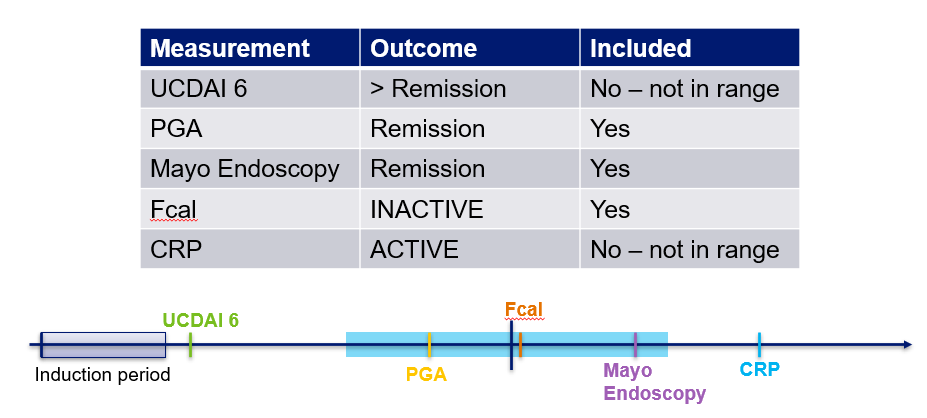
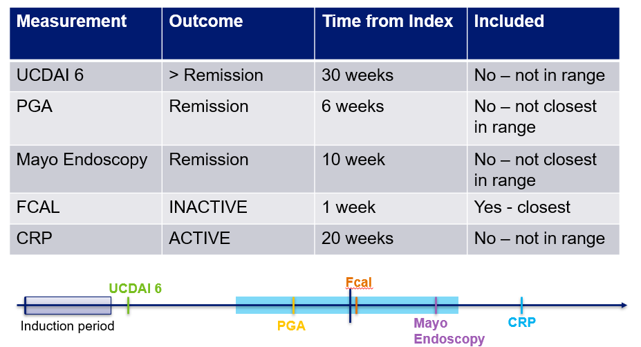

A Study of a Prospective Adult Research Cohort with Inflammatory Bowel
Disease (SPARC IBD) is a longitudinal study following adult IBD patients
as they receive care at 17 different sites across the United States. To
learn more about SPARC IBD and it’s development please see \[The
Development and Initial Findings of A Study of a Prospective Adult
Research Cohort with Inflammatory Bowel Disease (SPARC IBD)\]
(<https://doi.org/10.1093/ibd/izab071>).

Data from patient reported surveys (eCRFs), IBD Smartform and electronic
medication records (EMR) are integrated into IBD Plexus. The ibdplexus
package was created to synthesize this data into research ready formats.
This vignette focuses on the function in the ibdplexus package that
summarizes treatment response values available for a patient while on
various IBD medications. Please see the
[medication-in-SPARC](https://github.com/ccf-tfehlmann/ibdplexus/blob/master/vignettes/medication-in-SPARC.Rmd)
vignette for more detail on the creation of the medication journey,
including the start and end dates of medications which are used in the
creation of the treatment response table.

# tx\_response Function

The tx\_response function compiles all of a patient’s possible clinical
outcome data while on a medication. The medication start and end dates
are created using logic in the
[sparc\_med\_journey](https://github.com/ccf-tfehlmann/ibdplexus/blob/master/vignettes/medication-in-SPARC.Rmd)
function. The rigorousness of possible clinical outcomes is ordered:

1.  Endoscopic scores (Mayo Endoscopic Score, SES)
2.  Symptom Scores (UCDAI/SCDAI)
3.  PGA Score
4.  FCal Score
5.  CRP Score

All clinical assessment scores (endoscopic, symptom and PGA) have
defined cut off values for “Remission” or “Not Remission”. Similarly,
the lab biomarkers (FCal and CRP) have cut off values to define “ACTIVE”
versus “INACTIVE”. The values are described in the table below:

<table>
<colgroup>
<col style="width: 25%" />
<col style="width: 25%" />
<col style="width: 25%" />
<col style="width: 25%" />
</colgroup>
<thead>
<tr class="header">
<th>Rigorousness Rank</th>
<th>Outcome</th>
<th>Remission/INACTIVE</th>
<th>Not Remission/ACTIVE</th>
</tr>
</thead>
<tbody>
<tr class="odd">
<td>1 (UC)</td>
<td>Mayo Endoscopy Score</td>
<td>&lt;= 1</td>
<td>&gt;1</td>
</tr>
<tr class="even">
<td>1 (CD)</td>
<td>SES-CD</td>
<td>&lt;= 2</td>
<td>&gt;2</td>
</tr>
<tr class="odd">
<td>2 (UC)</td>
<td>UCDAI 6</td>
<td>&lt;= 1</td>
<td>&gt;1</td>
</tr>
<tr class="even">
<td>2 (CD)</td>
<td>SCDAI</td>
<td>&lt;= 150</td>
<td>&gt;150</td>
</tr>
<tr class="odd">
<td>3</td>
<td>PGA</td>
<td>Remission/Quiescent</td>
<td>Mild, Moderate, Severe</td>
</tr>
<tr class="even">
<td>4</td>
<td>FCal</td>
<td>&lt; 50ug/g</td>
<td>&gt;200 ug/g</td>
</tr>
<tr class="odd">
<td>5</td>
<td>CRP</td>
<td>&lt; 8mg/L</td>
<td>&gt;= 8 mg/L</td>
</tr>
</tbody>
</table>

The output of the tx\_response function is an excel with three possible
tabs: ALL SCORES, CLOSEST SCORE & MOST RIGOROUS. The tx\_response
function itself is flexible in its ability to filter to include only
specific medications of interest, or only specific time ranges of
interest. The CLOSEST SCORE tab is only included when a time range of
interest is specified. Examples of what is included in each tab is
outlined below.

### ALL SCORES

The ALL SCORES tab includes all scores within the time range of
interest, or all available scores when no time range is provided. An
example of what would be included in this tab for an interest in
outcomes at 1 year after med start date +/- 3 months is below.

### CLOSEST SCORE

The CLOSEST SCORE tab includes the closest score to a time of interest.
This tab is only included when a time range of interest is provided. An
example of what would be included for an interest in outcomes at 1 year
after med start date +/- 3 months is below.

### MOST RIGOROUS

The MOST RIGOROUS tab includes the most rigourous score available within
a time range of interest. If no time range of interest is inputted, it
will return the most rigourous score available at any time on a
medication. An example of what would be included for an interest in
outcomes at 1 year after med start date +/- 3 months is below.

## Column Definitions

The definitions of included columns are below:

<table>
<colgroup>
<col style="width: 80%" />
<col style="width: 19%" />
</colgroup>
<thead>
<tr class="header">
<th>Column_Name</th>
<th>Definition</th>
</tr>
</thead>
<tbody>
<tr class="odd">
<td>DEIDENTIFIED_MASTER_PATIENT_ID</td>
<td>Patient ID</td>
</tr>
<tr class="even">
<td>DIAGNOSIS</td>
<td>Diagnosis</td>
</tr>
<tr class="odd">
<td>MEDICATION</td>
<td>Medication</td>
</tr>
<tr class="even">
<td>MED_START_DATE</td>
<td>Med Start Date</td>
</tr>
<tr class="odd">
<td>MED_END_DATE</td>
<td>Med End Date</td>
</tr>
<tr class="even">
<td>DISEASE_ACTIVITY_MEASURE</td>
<td>Disease activity measure used in that row</td>
</tr>
<tr class="odd">
<td>TIME_BETWEEN</td>
<td>Time between disease activity date and med start date</td>
</tr>
<tr class="even">
<td>ABS_OUTCOME_VALUE</td>
<td>Value of the disease activity measure</td>
</tr>
<tr class="odd">
<td>SCORE_CATEGORY</td>
<td>Specified score category of disease measure</td>
</tr>
<tr class="even">
<td>DISEASE_ACTIVITY_MEASURE_DATE</td>
<td>Date of the disease activity measure</td>
</tr>
<tr class="odd">
<td>FAIL_INDUCTION_FLAG</td>
<td>Flag if the medication was stopped before the end of the induction
period</td>
</tr>
<tr class="even">
<td>STEROID_FLAG</td>
<td>Flag if disease activity date is during time when patient was also
on steroids</td>
</tr>
<tr class="odd">
<td>SURG_ON_MED</td>
<td>Earliest IBD related surgery date after medication start date</td>
</tr>
<tr class="even">
<td>HOSP_ON_MED</td>
<td>Earliest IBD related hospitalization date after medication start
date</td>
</tr>
<tr class="odd">
<td>TISSUE_RNA_60_DISEASE_ACTIVITY</td>
<td>Date of Tissue RNASeq closest to disease activity date, within +/-
60 days of disease activity date</td>
</tr>
<tr class="even">
<td>TISSUE_RNA_30_MED</td>
<td>Date of Tissue RNASeq closest to medication start date, within 30
days prior to medication started</td>
</tr>
<tr class="odd">
<td>OLINK_60_DISEASE_ACTIVITY</td>
<td>Date of Olink closest to disease activity date, within +/- 60 days
of disease activity date</td>
</tr>
<tr class="even">
<td>OLINK_30_MED</td>
<td>Date of Olink closest to medication start date, within 30 days prior
to medication started</td>
</tr>
<tr class="odd">
<td>BLOOD_RNA_60_DISEASE_ACTIVITY</td>
<td>Date of Blood RNASeq closest to disease activity date, within +/- 60
days of disease activity date</td>
</tr>
<tr class="even">
<td>BLOOD_RNA_30_MED</td>
<td>Date of Blood RNASeq closest to medication start date, within 30
days prior to medication started</td>
</tr>
</tbody>
</table>
