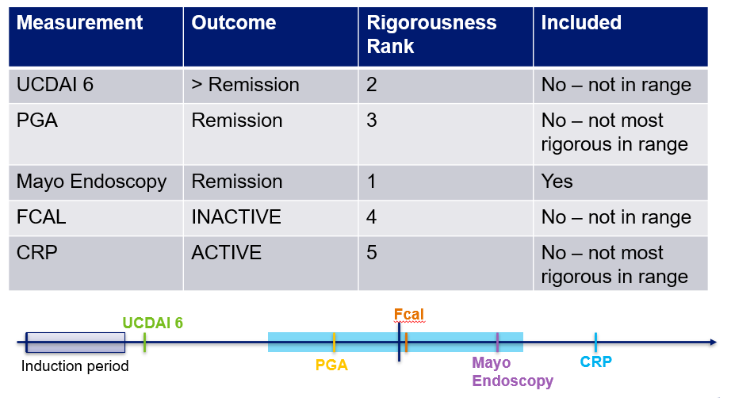

```{r, include = FALSE}
knitr::opts_chunk$set(
  collapse = TRUE,
  comment = "#>",
  eval = FALSE
)

options(rmarkdown.html_vignette.check_title = FALSE)
```

A Study of a Prospective Adult Research Cohort with Inflammatory Bowel Disease (SPARC IBD) is a longitudinal study following adult IBD patients as they receive care at 17 different sites across the United States. To learn more about SPARC IBD and it's development please see [The Development and Initial Findings of A Study of a Prospective Adult Research Cohort with Inflammatory Bowel Disease (SPARC IBD)] (<https://doi.org/10.1093/ibd/izab071>).

Data from patient reported surveys (eCRFs), IBD Smartform and electronic medication records (EMR) are integrated into IBD Plexus. The ibdplexus package was created to synthesize this data into research ready formats. This vignette focuses on the function in the ibdplexus package that summarizes treatment response values available for a patient while on various IBD medications. Please see the [medication-in-SPARC](https://github.com/ccf-tfehlmann/ibdplexus/blob/master/vignettes/medication-in-SPARC.Rmd) vignette for more detail on the creation of the medication journey, including the start and end dates of medications which are used in the creation of the treatment response table.

# tx_response Function

The tx_response function compiles all of a patient's possible clinical outcome data while on a medication. The medication start and end dates are created using logic in the [sparc_med_journey](https://github.com/ccf-tfehlmann/ibdplexus/blob/master/vignettes/medication-in-SPARC.Rmd) function. The rigorousness of possible clinical outcomes is ordered:

1.  Endoscopic scores (Mayo Endoscopic Score, Simple Endoscopic Score for Crohn's Disease (SES))
2.  Symptom Scores (UC Disease Activity Index (UCDAI)/Simplified CD Activity Index (SCDAI))
3.  Physicians Global Assessment (PGA) Score
4.  Fecal Calprotectin (FCal) Score
5.  C-Reactive Protein (CRP) Score

All clinical assessment scores (endoscopic, symptom and PGA) have defined cut off values for "Remission" or "Not Remission". Similarly, the lab biomarkers (FCal and CRP) have cut off values to define "ACTIVE" versus "INACTIVE". The values are described in the table below:

| Rigorousness Rank | Outcome | Remission/INACTIVE | Not Remission/ACTIVE |
|------------------|------------------|------------------|------------------|
| 1 (UC) | Mayo Endoscopy Score | \<= 1 | \>1 |
| 1 (CD) | SES-CD | \<= 2 | \>2 |
| 2 (UC) | UCDAI 6 | \<= 1 | \>1 |
| 2 (CD) | SCDAI | \<= 150 | \>150 |
| 3 | PGA | Remission/Quiescent | Mild, Moderate, Severe |
| 4 | FCal | \< 50ug/g | \>200 ug/g |
| 5 | CRP | \< 8mg/L | \>= 8 mg/L |

## Function Requirements 

The tx_response function has several input parameters that allow for flexibility in output. The parameters for the function are outlined below: 

*data* = A list of dataframes, typically generated by a call to load_data. Must include demographics, diagnosis, encounter, procedures, observations, biosample, omics_patient_mapping, prescriptions and labs.

*reports_path* = A path to already generated SPARC Reports.

*all_events* = Defaults to TRUE. Includes all disease activity measure events after a patient starts a medication.

*save_path* = Name of the desired output file. Must be .xlsx

*time_category* = Defaults to FALSE. Set to TRUE when only disease activity measures from a specified time range are required, and all_events can be FALSE. 

*month_interest* = Month to center time from of interest after medication start date. Defaults to 12 months. 

*month_range* = Range of months around the month of interest for which to include relevant disease activity measures. Defaults to 3 months. 

*filtered_med* = Defaults to FALSE. Set to TRUE to filter for only specific medications. 

*med_interest* = String of medications separated by | to search for when filtered_med = T. Possible medications are: Adalimumab, Azathioprine, Balsalazide, Certolizumab Pegol, Cyclosporine, Etrasimod, Golimumab, Guselkumab, Infliximab, Mercaptopurine, Mesalamine, Methotrexate, Mirikizumab, Natalizumab, Olsalazine, Ozanimod, Risankizumab, Sulfasalazine, Tacrolimus, Tofacitinib, Upadacitinib, Ustekinumab, Vedolizumab

*crp_value* = Numeric value for CRP INACTIVE/ACTIVE cutoff in mg/L. Defaults to 8. 

*fcal_low* = Numeric value for lower limit of FCal for INACTIVE/ACTIVE cutoff in ug/g. Anything below this will be INACTVE. Defaults to 50. 

*fcal_high* = Numeric value for lower limit of FCal for INACTIVE/ACTIVE cutoff in ug/g. Anything above this will be ACTIVE. Defaults to 200. Anything between fcal_low and fcal_high will be INDETERMINATE. 

## Function Output 

The output of the tx_response function is an excel with three possible tabs: ALL SCORES, CLOSEST SCORE & MOST RIGOROUS. The tx_response function itself is flexible in its ability to filter to include only specific medications of interest, or only specific time ranges of interest. The CLOSEST SCORE tab is only included when a time range of interest is specified. Examples of what is included in each tab is outlined below.

### ALL SCORES

The ALL SCORES tab includes all scores within the time range of interest, or all available scores when no time range is provided. An example of what would be included in this tab for an interest in outcomes at 1 year after med start date +/- 3 months is below.


### CLOSEST SCORE

The CLOSEST SCORE tab includes the closest score to a time of interest. This tab is only included when a time range of interest is provided. An example of what would be included for an interest in outcomes at 1 year after med start date +/- 3 months is below.


### MOST RIGOROUS

The MOST RIGOROUS tab includes the most rigourous score available within a time range of interest. If no time range of interest is inputted, it will return the most rigourous score available at any time on a medication. An example of what would be included for an interest in outcomes at 1 year after med start date +/- 3 months is below.



## Column Definitions

The definitions of included columns are below:

| Column_Name | Definition |
|-------------------------------------------------------|-----------------|
| DEIDENTIFIED_MASTER_PATIENT_ID | Patient ID |
| DIAGNOSIS | Diagnosis |
| MEDICATION | Medication |
| MED_START_DATE | Med Start Date |
| MED_END_DATE | Med End Date |
| DISEASE_ACTIVITY_MEASURE | Disease activity measure used in that row |
| TIME_BETWEEN | Time between disease activity date and med start date |
| ABS_OUTCOME_VALUE | Value of the disease activity measure |
| SCORE_CATEGORY | Specified score category of disease measure |
| DISEASE_ACTIVITY_MEASURE_DATE | Date of the disease activity measure |
| FAIL_INDUCTION_FLAG | Flag if the medication was stopped before the end of the induction period |
| STEROID_FLAG | Flag if disease activity date is during time when patient was also on steroids |
| SURG_ON_MED | Earliest IBD related surgery date after medication start date |
| HOSP_ON_MED | Earliest IBD related hospitalization date after medication start date |
| TISSUE_RNA_60_DISEASE_ACTIVITY | Date of Tissue RNASeq closest to disease activity date, within +/- 60 days of disease activity date |
| TISSUE_RNA_30_MED | Date of Tissue RNASeq closest to medication start date, within 30 days prior to medication started |
| OLINK_60_DISEASE_ACTIVITY | Date of Olink closest to disease activity date, within +/- 60 days of disease activity date |
| OLINK_30_MED | Date of Olink closest to medication start date, within 30 days prior to medication started |
| BLOOD_RNA_60_DISEASE_ACTIVITY | Date of Blood RNASeq closest to disease activity date, within +/- 60 days of disease activity date |
| BLOOD_RNA_30_MED | Date of Blood RNASeq closest to medication start date, within 30 days prior to medication started |
